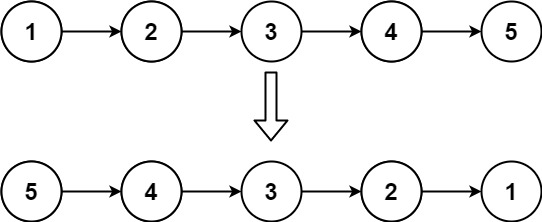

# 863. All Nodes Distance K in Binary Tree

## Question

We are given a binary tree (with root node `root`), a `target` node, and an integer value `K`.

Return a list of the values of all nodes that have a distance `K` from the `target` node.  The answer can be returned in any order.

**Example 1:**



```
Input: root = [3,5,1,6,2,0,8,null,null,7,4], target = 5, K = 2

Output: [7,4,1]

Explanation: 
The nodes that are a distance 2 from the target node (with value 5)
have values 7, 4, and 1.

Note that the inputs "root" and "target" are actually TreeNodes.
The descriptions of the inputs above are just serializations of these objects.
```

**Note:**

1. The given tree is non-empty.
2. Each node in the tree has unique values `0 <= node.val <= 500`.
3. The `target` node is a node in the tree.
4. `0 <= K <= 1000`.

## **Solution**

```cpp
/**
 * Definition for a binary tree node.
 * struct TreeNode {
 *     int val;
 *     TreeNode *left;
 *     TreeNode *right;
 *     TreeNode(int x) : val(x), left(NULL), right(NULL) {}
 * };
 */
class Solution {
public:
    vector<int> distanceK(TreeNode* root, TreeNode* target, int K) {
        // sol: bfs, recursion (pre-order, convert to graph)
        unordered_map<int, vector<int>> g; // graph
        queue<int> q;
        vector<bool> visited(500, false);
        vector<int> res;
        buildGraph(root, NULL, g);
        q.push(target->val);
        visited[target->val] = true;
        while (!q.empty()) {
            int size = q.size();
            for (int i = 0; i < size; ++i) {
                int t = q.front();
                q.pop();
                if (K == 0) {
                    res.push_back(t);
                    continue;
                }
                for (auto& val : g[t]) {
                    if (!visited[val]) {
                        q.push(val);
                        visited[val] = true;
                    }
                }
            }
            --K;
        }
        return res;
    }
    
    void buildGraph(TreeNode* node, TreeNode* pre, unordered_map<int, vector<int>>& g) {
        if (!node) {
            return;
        }
        if (pre) {
            g[node->val].push_back(pre->val);
            g[pre->val].push_back(node->val);
        }
        buildGraph(node->left, node, g);
        buildGraph(node->right, node, g);
    }
};
```
